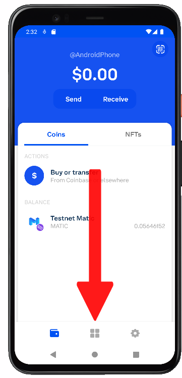

# Heptagon Demo

To use our Dapp correctly, you must follow the following steps.

- Download the Coinbase Wallet app on your cell phone.
  - https://play.google.com/store/apps/details?id=org.toshi&hl=en_US&gl=US

- Once you have the application, open a wallet on your cell phone. It is not necessary to have a coinbase account to open the wallet.

- Now go to the Dapps section, it's the icon with 4 squares, in the middle of the bottom bar.

- On the screen that appeared, go to the address bar and enter the following URL.

LINK: https://main.d23h0ql60ng13v.amplifyapp.com/

- By giving enter on the lower keyboard, the Heptagon Dapp will open.

- Already in the Dapp you will first have to login with a username and password, in this case we leave you a test one.

User: strange@coinbase.com

Pass: toortoor1

- If you had a successful login, the Connect button will be enabled.

- Later, when selecting the connect button, it will ask us to which netwrk we want to connect.

- Once the network is selected, press the StartApp button.

- And ready you can use our dapp.

