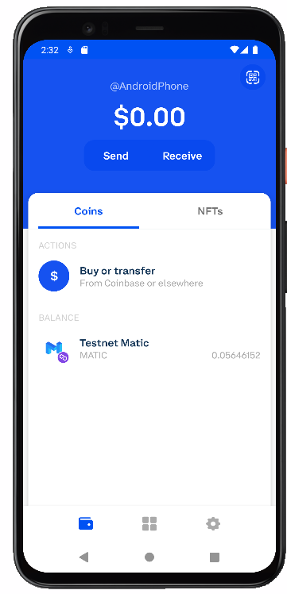

# Heptagon Demo

Para utilizar nuestra Dapp correctamente, deberas seguir los siguientes pasos.

- Descarga la aplicacion de Coinbase Wallet en tu celular.
  - https://play.google.com/store/apps/details?id=org.toshi&hl=en_US&gl=US

- Una vez tengas la aplicacion abre una wallet en tu celular. No es necesario tener cuenta de coinbase para abrir la wallet.

- Ahora ve a la seccion de Dapps, es el icono con 4 cuadros, enmedio de la barra inferior.

- En la pantalla que aparecio, ve a la barra de direcciones y coloca el siguiente URL.

LINK: https://main.d23h0ql60ng13v.amplifyapp.com/

- Al dar enter en el teclado inferior nos abrira la Dapp de Heptagon.

- Ya en la Dapp primero tendras que hacer login con un usuario y contraseña, en este caso te dejamos uno de testing.

User: strange@coinbase.com

Pass: toortoor1

- Si tuviste un login satisfactorio, se habilitara el boton de Connect.

- Posteriomente al seleccionar el boton de connect nos preguntara a que netowrk deseamos conectarnos.

- Una vez seleccionada la network presionaremos el boton de StartApp.

- Y listo ya puedes usar nuestra dapp.

